# TJBot-ChatBot-NodeRED-Workshop
Chatbot Workshop using a TJBot and Node-RED - This workshop is a fast paced 60 minute session on how to use Node-RED to construct a Chatbot using IBM Cloud Watson Cognitive microservices.

# TJBot ChatBot Workshop Agenda
* Introduction to Node-RED and TJBot
* Introduction to Watson Cognitive Services - Speech to Text / Text to Speech / Language Translation / Watson Conversation / Watson Assistant
* Build a Text to Speech flow using Node-RED
* Build a Speech to Text flow using Node-RED
* Build a Language Translation flow using Node-RED
* Build a Universal Translator
* Build a Conversation flow using Node-RED
* Make TJBot wave Goodbye
* ChatBot Finale !

## Introduction to Node-RED and TJBot
* Node-RED is an open-source Node.js application that provides a visual programming editor that makes it easy to wire together flows. Node-RED embodies a low-code style of application development, where developers can quickly create meaningful applications without having to write reams of code. There are a number of benefits to low-code application development, all of which we’ve seen first-hand with Node-RED.

 * It reduces the time it takes to create a working application: This allows the real value to be realized much quicker than with traditional development models.
 * It’s accessible to a wide range of developers and non-developers: This is one of the most important benefits we’ve seen. Anyone who understands a domain-specific problem, such as a business analyst, a linguist, or a building engineer, will know the discrete steps needed to solve it. Node-RED gives them the tools to express those steps within a flow and build the solution for themselves.
 * The visual nature helps users to see their application: “Show, don’t tell” is a powerful concept. We often see Node-RED used to demo API capabilities, such as for Watson cognitive services. It’s so effective because the visualization of your application logic shows the art of the possible without having to explain every semi-colon, bracket, and brace. Not everyone thinks in lines of code; the visual representation of application logic is much more relatable.

* TJBot is a little robot that brings a Raspberry Pi to life using Watson services.
 * Link - https://github.com/ibmtjbot/tjbot/blob/master/README.md

### Connect to your workshop TJBot
* Your laptop needs to be connected to the IBM Wireless network.  If your system is connected to the IBMInternet visitor network, you will not be able to connect to your TJBot.  Connect your system to the IBM internal wireless network before proceeding.
* Open a browser tab on your laptop - Firefox or Chrome recommended.
* Next to your TJBot, there will be a postcard / Post-IT with the IP Address of your TJBot.
* Enter **`http://<your TJBot IP address>:1880`**
* Node-RED will load and you can proceed with the rest of the workshop.

## IBM Cloud Account
* If you do not yet have an IBM Cloud account, please create one now.
* Login at http://bluemix.net

## Introduction to Watson Cognitive Services - Speech to Text / Text to Speech / Language Translation / Watson Conversation / Watson Assistant
Link - https://console.bluemix.net/catalog/?category=watson
* Speech to Text
* Text to Speech
* Language Translation
* Watson Conversation
* Watson Assistant

## Build a Text to Speech flow using Node-RED
0. Create a Text to Speech service instance
 * Visit https://console.bluemix.net/catalog/services/text-to-speech
 * Press the Create button to create an instance of the Text to Speech service.
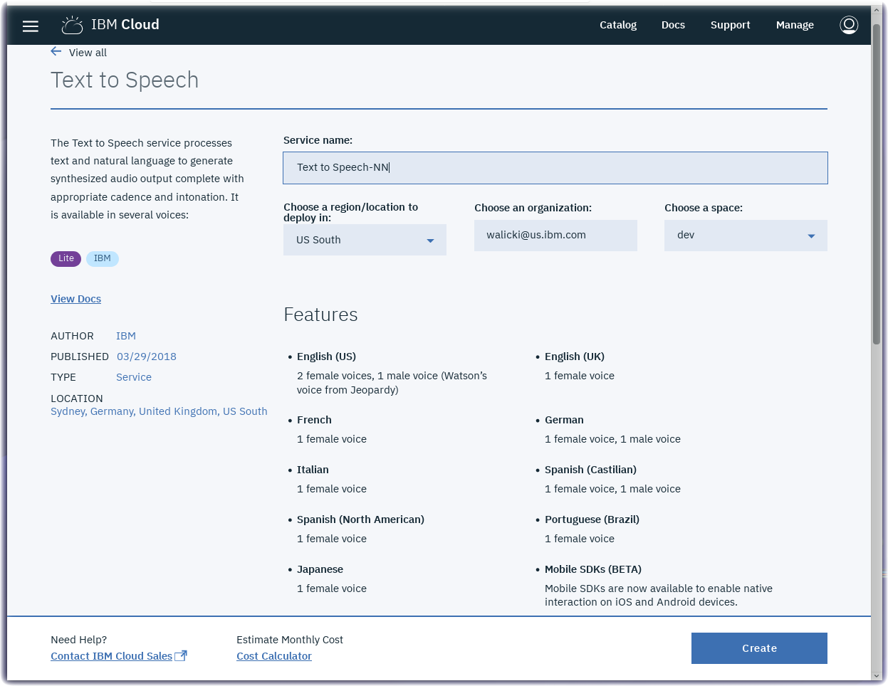
 * Select **Service credentials**
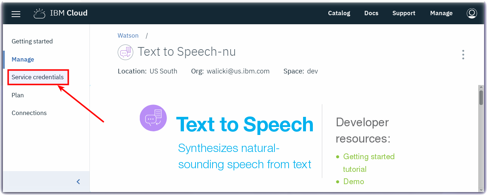
 * Click on the New credential button.
 * Click on the View credentials twistie.
 * Copy the username and password.
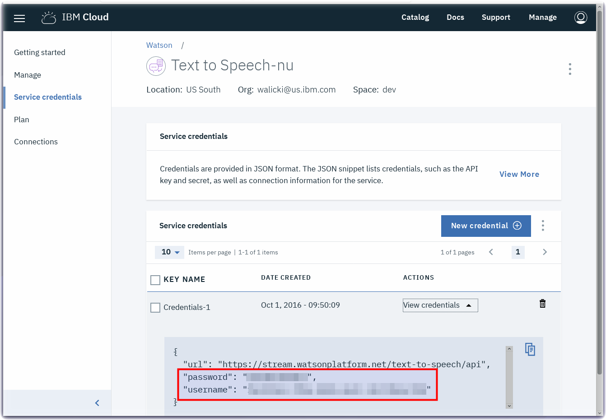
 * Return to your Node-RED flow browser tab.
 * Double-click to open the Text to Speech node (1).
 * Paste the username and password credentials into the Text to Speech node (2).
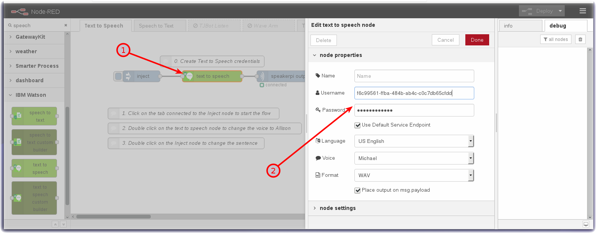
 * Press the Done button.
 * Press the Deploy button.
1. Click on the tab connected to the **inject node** to start the flow.
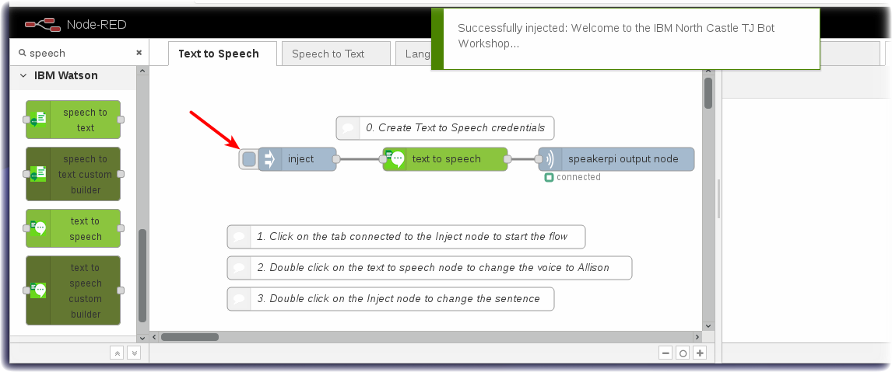
2. Double click on the **text to speech** node to change the voice to Allison.
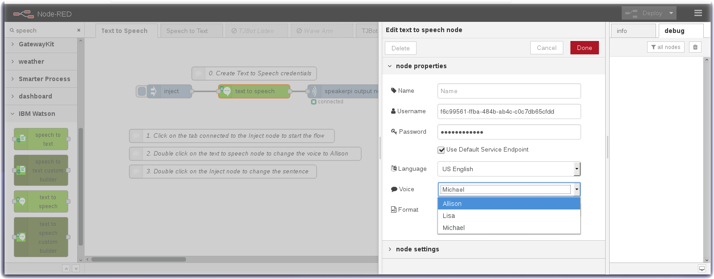
 * In the Voice dropdown, select Allison.
 * Press the Done button.
 * Press the Deploy button.
 * Click on the tab connected to the **inject node** to run the flow again.
3. Double click on the **inject node** to change the sentence.

 * In the payload field, enter any sentence (eg "This workshop is awesome")
 * Press the Done button.
 * Press the Deploy button.
 * Click on the tab connected to the **inject node** to run the flow again.

## Build a Speech to Text flow using Node-RED
0. Turn to the next flow tab in the Node-RED editor.
1. Create Speech to Text service instance
 * Visit https://console.bluemix.net/catalog/services/speech-to-text
 * Press the Create button to create an instance of the Speech to Text service.
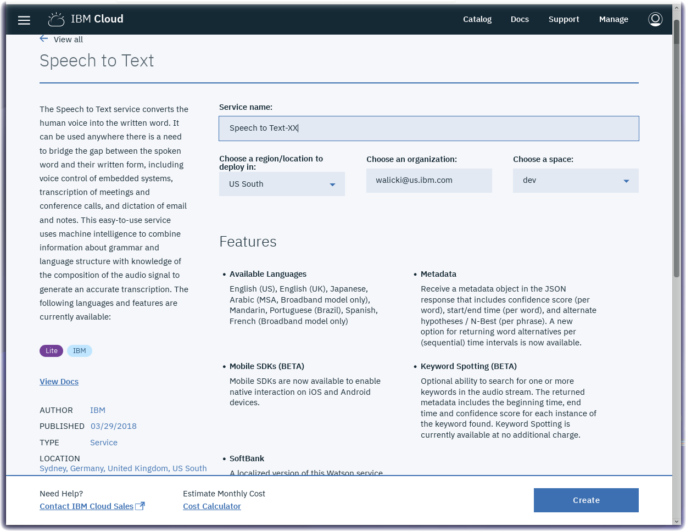
 * Select **Service credentials**
 * Click on the New credential button.
 * Click on the View credentials twistie.
 * Copy the username and password.
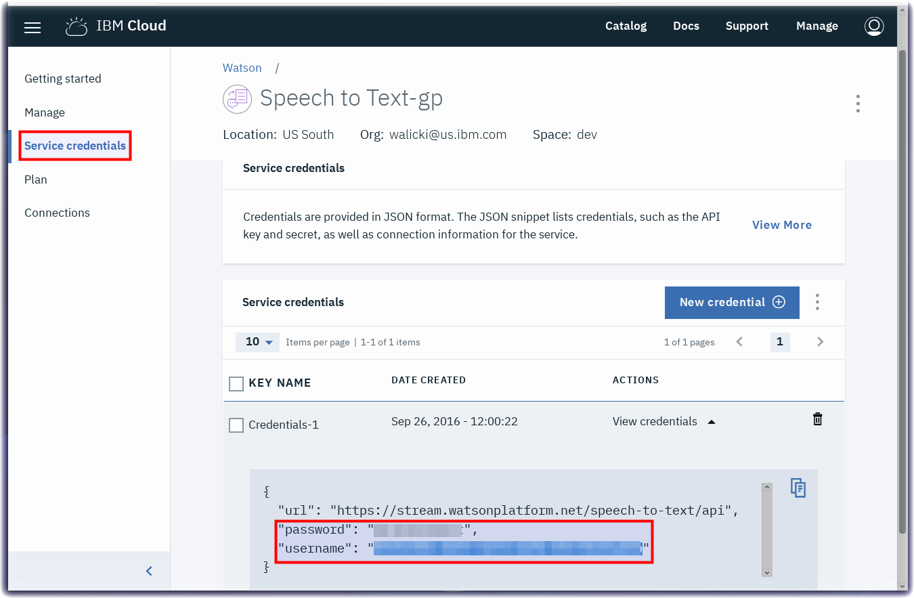
 * Return to your Node-RED flow browser tab.
 * Double-click to open the Speech to Text node (1).
 * Paste the username and password credentials into the Speech to Text node (2).
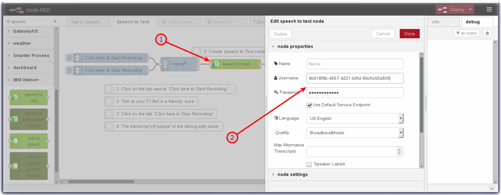
 * Press the Done button.
 * Press the Deploy button.
2. Click on the tab connected to the **Click here to Start Recording** to start the flow.

 * Talk to the TJBot.
 * Click on the tab connected to the **Click here to Stop Recording**
 * The transcription will appear in the debug side panel.

## Build a Language Translation flow using Node-RED
0. Turn to the next flow tab in the Node-RED editor.
1. Create Language Translator Service instance.
 * Visit https://console.bluemix.net/catalog/services/language-translator
 * Press the Create button to create an instance of the Language Translator service.
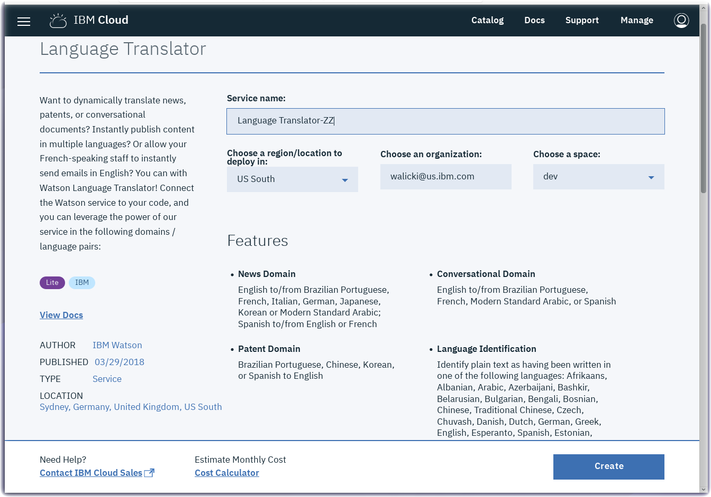
 * Select **Service credentials**
 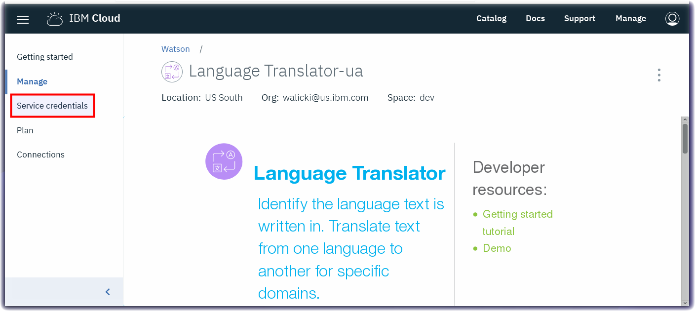
 * Click on the New credential button.
 * Click on the View credentials twistie.
 * Copy the username and password.
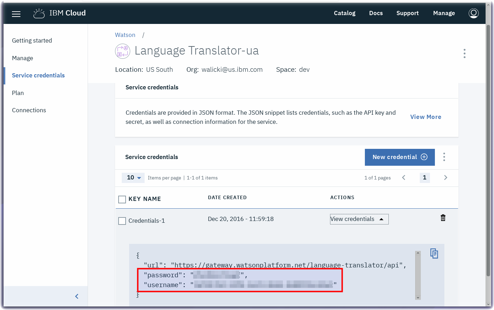
 * Return to your Node-RED flow browser tab.
 * Double-click to open the Language Translator node (1).
 * Paste the username and password credentials into the Language Translator node (2).
 * Select Spanish in the Target dropdown.
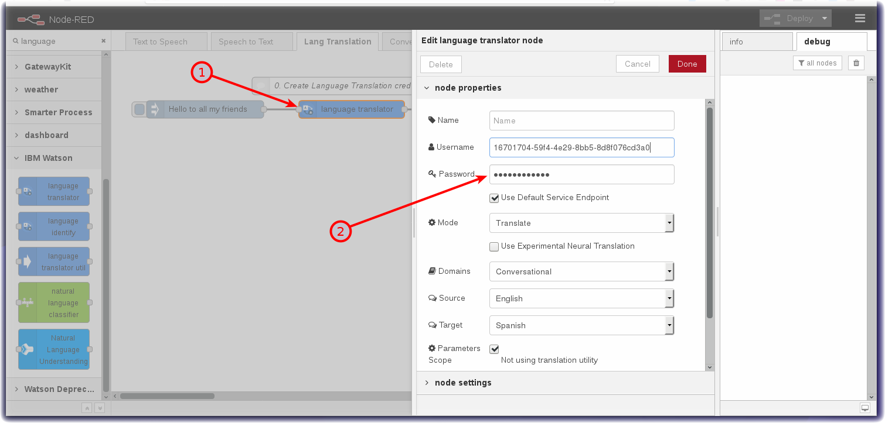
 * Press the Done button.
 * Press the Deploy button.
2. Click on the tab connected to the **inject node** to start the flow.

 * The translation will appear in the debug side panel.
3. Combine the Language Translator capabilities and Text to Speech.
 * Drag a wire from the Language Translator output node to the input of the Text to Speech node.
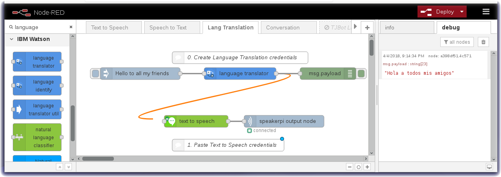
 * Double click on the text to speech node (1) and, similar to the section above, paste in the API key username / password (2).
 * Select Spanish in the Language drop down (3).
 
 * Press the Done button.
 * Press the Deploy button.
 * Click on the tab connected to the **inject node** to start the flow.
4. Modify the sentence in the Inject node, have Watson translate it to Spanish and speak the sentence in Spanish.
5. Translate and speak another language by changing the language in both the language translator node and the text to speech node.

## Build a Universal Translator with Watson
1. Combine the three flows to build a simple Universal Translator.
2. Just paste in your API Keys!
 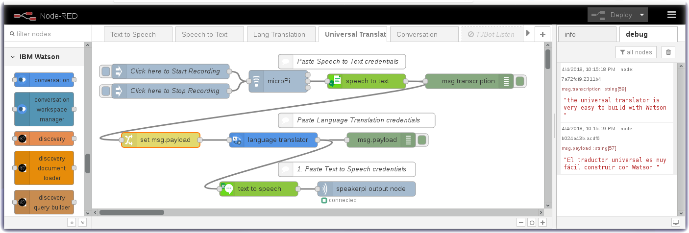
 * Press the Done button.
 * Press the Deploy button.
3. Click on Start Recording tab, talk and then click on the Stop Recording tab.

## Build a Conversation flow using Node-RED
0. We need more than an hour long workshop so I've built the flow for you.
 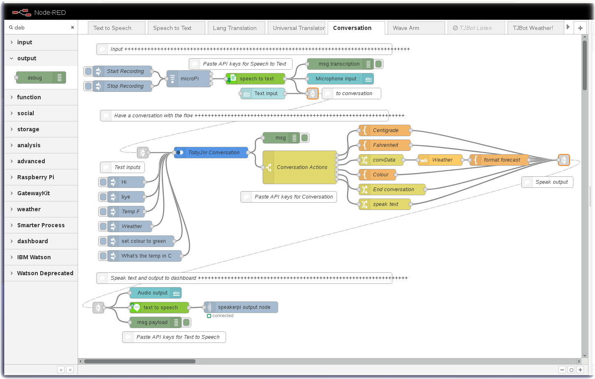

## Make TJBot Wave Goodbye
0. Turn to the Wave Arm flows.
1. Click on the tab connected to the inject node.

## ChatBot Finale !
0. Enable the **TJBot Listen** flow by clicking on the tab and sliding the Status toggle to Enabled.
1. Press the Deploy button.
2. All of the TJBots are now listening for a wake word.
3. The instructor will say *Hey Watson*
4. All of the TJBots will reply - *How can I help you?*
